# Planner — Data Model (Supabase / Phase 2)

This is the canonical design for the synced backend. It supersedes the Phase‑1
in‑browser shape in [`src/types.ts`](../src/types.ts). The SQL that implements it
lives in [`supabase/migrations/`](../supabase/migrations); this document explains
**why** it is shaped this way so a future session can build on it with confidence.

Status: **design frozen.** The open questions from the design discussion have all
been decided (see [Decisions](#decisions)). The migrations are ready to apply.

---

## The one idea everything follows from

> **Every attribute lives at the grain at which it varies.**

A planner is mostly *recurring* events, and the hard part is that some facts
belong to the *definition* of a repeating thing and others belong to a *single
occurrence* of it. Conflate them and recurrence breaks. So the model has three
grains, and each table belongs to exactly one:

| Grain | Keyed by | Holds | Example tables |
|---|---|---|---|
| **Series** (definition / template) | `series_id` | title, schedule, checklist *lines*, default roster, reminder rules, notes | `event_series`, `checklist_item`, `event_participant`, `reminder`, `note` |
| **Occurrence** (one date of a series) | `(series_id, occurrence_start)` | reschedule/cancel/done, ticks, per‑occurrence roster changes, sent notifications, dependency edges | `event_occurrence`, `occurrence_item_state`, `occurrence_item_removed`, `occurrence_participant_override`, `notification_log`, `occurrence_dependency` |
| **Lookup** (closed vocab) | `code` | enumerable constants | `item_status`, `occurrence_status`, `rsvp_status`, `participant_role`, `reminder_method` |

`occurrence_start` is the **original** scheduled instant of an occurrence — its
permanent identity, even if the occurrence is later moved (`rescheduled_to`).
Occurrence rows are **sparse**: a row exists only when something diverges from
the series default (a tick, a cancel, a reschedule). A clean infinite series has
zero occurrence rows. This is the CalDAV / RFC‑5545 exception model.

> ⚠️ `occurrence_start` in the occurrence‑grain tables is deliberately **not** a
> foreign key to `event_occurrence` — most occurrences are *virtual* (never
> materialised). Its integrity is maintained by the app's calendar library, not
> by Postgres. See [Decision 4](#4-occurrence-identity-is-the-original-slot).

---

## Entity map

```mermaid
erDiagram
    account ||--o{ account_member : "has members"
    app_user ||--o{ account_member : "belongs to"
    account ||--o{ event_series : "owns (RLS scope)"

    event_series ||--o{ event_occurrence : "diverges (sparse)"
    event_series ||--o{ event_series : "template_id (provenance)"
    event_series ||--o{ event_series : "split_from_id (lineage)"

    event_series ||--o{ checklist_item : "owns items"
    event_series ||--o{ occurrence_item_removed : "tombstone"
    event_series ||--o{ occurrence_item_state : "checkmarks"
    checklist_item ||--o{ occurrence_item_removed : "hides"
    checklist_item ||--o{ occurrence_item_state : "ticks"
    item_status ||--o{ occurrence_item_state : "constrains"
    occurrence_status ||--o{ event_occurrence : "constrains"

    event_series ||--o{ event_participant : "default roster"
    event_series ||--o{ occurrence_participant_override : "per-occ change"
    event_series ||--o{ participation_requirement : "requires"
    app_user ||--o{ event_participant : "participates"
    rsvp_status ||--o{ event_participant : "constrains"
    participant_role ||--o{ event_participant : "constrains"

    event_series ||--o{ reminder : "reminder rules"
    app_user ||--o{ reminder : "owns"
    reminder_method ||--o{ reminder : "constrains"
    reminder ||--o{ notification_log : "fired (sparse)"

    event_series ||--o{ note : "owns (1:N)"
    app_user ||--o{ note : "authors"

    event_series ||--o{ occurrence_dependency : "dependent / prerequisite"
    occurrence_status ||--o{ occurrence_dependency : "required_status"

    account ||--o{ list : "owns (RLS scope)"
    list ||--o{ list_item : "owns items"
    person ||--o{ list_item : "assignee (nullable)"
    list_item ||--o{ list_item_event_link : "surfaced on"
    event_series ||--o{ list_item_event_link : "at occurrence"
```



The authoritative column list is the SQL in `supabase/migrations/0001_schema.sql`.

---

## Decisions

These resolve every open question raised during design. Each is stated with the
rejected alternative so the trade is recoverable later.

### 1. Tenancy & access = `account`
A user belongs to one or more **accounts** (`account_member`); an `event_series`
belongs to one account. **Account membership is the only thing RLS checks.**
`event_participant` is *domain roster + RSVP + per‑user reminders* — who is
involved and notified — **not** an access mechanism. (The old `event_series.shared`
flag is gone; it was a third, ambiguous visibility lever.)
*Rejected:* participant‑scoped or per‑row sharing. It made every RLS policy a
union of three rules. Account‑scoped is one rule, joined down from the series.

### 2. Recurrence = RFC‑5545 RRULE strings, **never `COUNT`**
`event_series.rrule` is an iCal RRULE. Storage permits only **`UNTIL`‑bounded or
infinite** rules — `COUNT` is forbidden. All RRULE math (expansion, trimming,
re‑anchoring) happens **in the app** via a calendar library
([`rrule`](https://github.com/jkbrzt/rrule)); Postgres never parses a rule.
*Why ban `COUNT`:* on a series split the new series inherits the rule. `UNTIL` is
absolute and copies correctly; `COUNT` would restart the count and over‑generate.
Banning it makes a verbatim copy correct and makes `UNTIL` the single way a
series ends. Convert any `COUNT` rule to `UNTIL` at the app boundary before it is
ever stored.

### 3. "Edit this and following" = **series split**, not temporal versioning
Implemented by `split_series()` (migration `0003`). It ends the old series before
a cutover and starts a fresh copy from it, carrying every future per‑date row
onto the copy, atomically. There are **no** `valid_from`/`valid_until` ranges on
any table.
*Rejected:* per‑row temporal validity. It taxed *every read* with a range
predicate on three tables; splitting moves the cost to one rare write.
**Contract (load‑bearing):** the caller passes the **cutover** as a *genuine
`occurrence_start`* of the series (computed by the calendar lib — never raw
"now"), plus the *truncated* old rule. The new series is anchored at that slot,
so the future rows it adopts (which keep their original `occurrence_start`) land
exactly on its generated grid. Pass an arbitrary instant and you silently
reschedule the event and re‑orphan the rows. See the header comment in
`0003_functions.sql`.

### 4. Occurrence identity is the **original slot**
`(series_id, occurrence_start)` where `occurrence_start` is the instant the rule
*originally* produced. Moving an occurrence sets `rescheduled_to`; the identity
never changes. Because occurrences are virtual, `occurrence_start` is **not** an
FK. The corollary: you never edit a live series' `dtstart`/`rrule` in place in a
way that shifts the grid — that goes through `split_series`, which re‑homes the
dependent rows.

### 5. Checklist items are **series‑owned (copy semantics)**
The "item primitive" collapses into `checklist_item`: text (`label`), order
(`sort_order`, `group_label`), and ownership (`owner_series_id`) in one row. There
is **no shared `item` table and no cross‑checklist sharing** — editing one
checklist never changes another. On a split, list items are copied with **fresh
ids** and future ticks/tombstones retargeted to them; the two series fork.
*Rejected:* a normalized `item` + `checklist_item(item_id, position)` junction.
For a planner you almost always want copy semantics (my "milk" ≠ your "milk"); the
junction's only real payoff — sharing — is the behaviour we *don't* want, and it
buys nothing else over an owned, ordered row.
- `occurrence_start IS NULL` → a **list item**: part of every occurrence.
- `occurrence_start` set → a **one‑off add** to that single occurrence.
- `occurrence_item_removed` is the matching **tombstone**: hide a list item on
  one occurrence. Add and remove are symmetric.

### 6. Notes are **series‑owned (1:N)**, symmetric with items
`note.owner_series_id`; **no `event_note` junction.** A note belongs to one
series and is copied on split like any other attachment.
*Rejected:* the M:N `note`/`event_note` design. It was the lone asymmetry in the
schema (items copy, notes share) and it encoded a silent propagation policy
*inside* `split_series` (a copy and original sharing note rows across the split
boundary). It also hid a real bug: the M:N junction was never carried on split,
so future note attachments were lost. Owned notes fix both. A shared
"knowledge‑base note across events" is a separate, deliberate feature if ever
wanted — not the default.

### 7. Completion, with or without a checklist
- **No checklist:** set `event_occurrence.status` (a code from `occurrence_status`)
  to mark the whole occurrence done/skipped/blocked. `null` = compute.
- **With a checklist:** an occurrence is **done** when every `required`
  `checklist_item` for it has a `done` row in `occurrence_item_state`. This is
  derived in the app, not stored — `event_occurrence.status` left `null` means
  "compute from items." Setting it explicitly overrides the computation.

### 8. Dependencies = **enumerated per‑occurrence edges**
`occurrence_dependency` links a `(dependent_series, dependent_occurrence)` to a
`(prerequisite_series, prerequisite_occurrence)` with a `required_status`
(default `done`). There is **no rule form** — the app materialises edges as
occurrences are scheduled, and `split_series` rescues existing edges on both
ends. Acceptable at household scale; revisit if edge volume grows.

### 9. `event_series` carries `all_day`, `duration`, `created_by`, timestamps
Reintroduced from the Phase‑1 `CalendarEvent` and reconciled with the split
function (which references them). `dtstart` is `timestamptz`; an all‑day event is
`all_day = true` with `duration` in whole days. `dtstart`/`rrule` are `null` only
on templates.

### 10. Templates live in `event_series` (`is_template = true`)
A template has `is_template = true`, `dtstart`/`rrule` `null`, and owns
checklist items / roster / reminders / notes like any series. "New from template"
is an **app‑side deep copy** into a concrete series with a real `dtstart`, setting
`template_id` (provenance, nullable = standalone). Templates **cannot be split**
(the function guards against it). `split_from_id` records this‑and‑following
lineage, distinct from `template_id`.

**Wired into the app (2026‑06‑20).** `AppState.templates: EventTemplate[]` (a series
shell — title / all‑day / duration / roster / attachments, no timing). `SupabaseStore`
loads them with `is_template = true` and writes them via `writeTemplate` (same
roster/attachment sync as a real event, `dtstart`/`rrule` `null`). The event editor's
**"Save as template"** copies the current form into a new template (fresh attachment
ids); in *new* mode a **"Start from a template"** picker deep‑copies a template into
the draft (fresh attachment ids) and the created event carries `template_id`
provenance. Templates are reviewed/deleted in **Settings**. They never appear on the
calendar (the event read filters `is_template = false`).

### 11. Standalone Lists = `list` + `list_item`, single-context `done`, linkable to occurrences
The undated to‑do view (Phase‑1 `ListItem`) becomes two account‑scoped tables plus
one occurrence‑grain link, landing in migration `0009_lists.sql`:
- **`list`** — a named list (`title`, `sort_order`), scoped to `account_id`.
- **`list_item`** — one to‑do: `group_label` (an in‑list **header**, exactly like
  `checklist_item.group_label`), `title`, `done`, `person_id` (assignee;
  `on delete set null` = becomes shared), `sort_order`, **`due_on date`** (optional
  deadline; `null` = none), `created_at`.
- **`list_item_event_link`** — ties a to‑do to a **concrete occurrence**:
  `(list_item_id, series_id, occurrence_start)`, same grain and rules as
  `occurrence_dependency`.

Four sub‑decisions, each with its rejected alternative:

**`done` lives on the item — the one divergence from `checklist_item`.** A standalone
list is single‑context, so there is no per‑occurrence tick table
(`occurrence_item_state`); the item is simply done or not, and a checked item **stays
in place** (it can be unchecked). *Rejected:* per‑occurrence ticks. They exist for
checklists only because a recurring event's list resets each occurrence — a standalone
to‑do has exactly one context, so the extra grain is pure overhead.

**Headers are a `group_label` string, not a table.** Verbatim copy of the
`checklist_item` shape, so the grouping/sort logic transfers: `sort_order` is
position‑derived on write, ordered + grouped on read — identical to checklists.
*Rejected:* a `list_section` table. It buys stable header identity and empty headers at
the cost of a third table and ordering bookkeeping; not worth it at household scale, and
inconsistent with checklists.

**Linking is occurrence‑grained with a single source of truth for the tick.** A to‑do
("buy cat", added in July) is surfaced inside a concrete occurrence ("go to pet store"
in November) via one `list_item_event_link` row. Ticking it **in the occurrence or in
the Lists view both write the same `list_item.done`** — there is no
`occurrence_item_state` row for a linked item. Realtime reload keeps both views in
lockstep. The link is M:N‑capable (the same to‑do can hang off "pet store" *and*
"shelter"; done anywhere = done everywhere, coherent because `done` is on the one item).
`occurrence_start` is the **original slot** and, like every occurrence‑grain table, is
**not** an FK (most occurrences are virtual — Decision 4). Both ends `on delete cascade`:
deleting the event drops the link, never the to‑do. *Rejected:* linking to the whole
series (loses "that November trip"); and duplicating the to‑do as a `checklist_item` on
the event (two `done`s to reconcile — the bug this design avoids).

**A linked to‑do does NOT gate the occurrence's completion.** It is a surfaced
convenience line, not a `required` checklist item, so whether the cat is bought never
blocks "go to pet store" from being marked done (Decision 7's math ignores it).
*Rejected:* counting links toward occurrence completion — it couples list progress to
event completion; add a per‑link `required` flag later if ever wanted.

Grain note: `list`/`list_item` sit **outside** the series/occurrence model
(account‑grained, single‑context); only `list_item_event_link` touches the occurrence
grain, and it reuses Decision 4's identity rules.

### 12. Shares & pins = one occurrence-grain table (`occurrence_share`)
A way to draw attention to a **specific occurrence**. Two faces of one mechanism:
- **Share** — user A flags an occurrence *for* user B; B gets an in‑app inbox entry
  (and, later, a push). All events are already visible to every account member
  (Decision 1), so a share is an *attention* signal, never an access grant.
- **Pin / favorite** — a private bookmark a user makes for themselves to jump back to
  an occurrence quickly; no notification, visible only to them.

A pin is just a self‑share, so both live in one table, landing in migration
`0012_shares.sql` (planned):

```sql
create table occurrence_share (
  id               uuid primary key default gen_random_uuid(),
  series_id        uuid not null references event_series(id) on delete cascade,
  occurrence_start timestamptz not null,        -- original slot, NOT an FK (Decision 4)
  from_user        uuid not null references app_user(id) on delete cascade,
  to_user          uuid not null references app_user(id) on delete cascade,
  kind             text not null,               -- 'share' | 'pin'
  message          text,                        -- shares only; null for pins
  created_at       timestamptz not null default now(),
  read_at          timestamptz,                 -- inbox read/dismiss state (shares)
  unique (from_user, to_user, series_id, occurrence_start)
);
```
- **Share** = `from_user = A, to_user = B`, `kind = 'share'`.
- **Pin** = `from_user = to_user = me`, `kind = 'pin'`.

Sub‑decisions, each with its rejected alternative:

**Pins and shares are one table, distinguished by sender vs recipient.** They share
identical occurrence keying, RLS, realtime and load/apply paths; only *visibility* and
*whether a toast fires* differ. *Rejected:* two tables (`event_favorite` +
`event_share`) — duplicates all of that plumbing for a one‑column difference.

**One RLS policy yields both visibilities:** `using (to_user = auth.uid() or from_user =
auth.uid())` (within the account). A pin (`me,me`) is visible only to me; a share (`A→B`)
is visible to both A (to manage/unshare) and B (to act). *Rejected:* a kind‑specific
policy pair — unnecessary once the row carries both endpoints.

**"No notification for a pin" is a client rule, not schema.** Pins and shares are
structurally identical rows; the inbox/toast fires only for
`kind = 'share' and to_user = me and from_user <> me`. Pins just populate the favorites
list. *Rejected:* a `notified` boolean — derivable from `kind` + endpoints.

**Explicit `kind`, rather than inferring a pin from `from_user = to_user`.** Leaves room
for a genuine notify‑myself "note to self" share (a self‑row that *should* inbox)
without colliding with a silent pin. Cheap insurance. *Rejected:* inferring pin‑ness —
closes off self‑shares forever.

**Occurrence grain reuses Decision 4 identity.** `occurrence_start` is the original
computed slot, addressable whether or not an `event_occurrence` row exists, and is
**not** an FK. It survives a reschedule (identity stays the original slot); an orphaned
row (the series rule no longer yields that date) simply doesn't render — the same
tolerance as `occurrence_dependency` / `list_item_event_link`. `split_series` should
migrate future `occurrence_share` rows onto the new series id alongside the other
occurrence‑grain tables (or deliberately leave them — decide at build).

**Realtime + delete delivery.** Add `occurrence_share` to the `supabase_realtime`
publication so a share reaches B's open app live, and set `REPLICA IDENTITY FULL` so an
un‑pin / dismiss (DELETE) propagates — RLS can't evaluate the `to_user`/`from_user` gate
against a default PK‑only delete payload (see migration `0011`).

Client shape: `load()` returns the user's visible rows (RLS‑filtered); the app splits
them into `favorites` (`kind='pin'`), `inbox` (`kind='share'`, to me) and `sent`
(`kind='share'`, from me) — all filters over one array. The entry point is
`OccurrenceSheet` (a star to pin, a "Share with…" picker), where dependency‑ and
to‑do‑linking already live.

**Background push is out of scope here.** A notification when the recipient's app is
*closed* needs the app's first backend component (a Supabase Edge Function +
web‑push subscriptions) and would serve reminders too; the in‑app inbox/toast is free.
See [`NEXT_SESSION.md`](./NEXT_SESSION.md) §6 for the build plan and the two layers.

### 13. Private lists — per-list visibility scope
Decision 11 made every list account-wide. This adds an opt-in **private** scope so a user
can keep a list to themselves, *without* changing how linked items surface on events.
Lands in migration `0013_list_visibility.sql` (planned).

Schema delta on `list`:
- `owner_id uuid not null references app_user(id)` — the creator.
- `visibility text not null default 'account' check (visibility in ('account','private'))`.
  `account` = every member sees it (today's behaviour); `private` = only `owner_id`.

`list_item` is unchanged: an item **inherits its list's scope** for direct visibility, and
its `person_id` stays a pure **assignment** (a domain `person`, possibly not even a login) —
orthogonal to *who can see the list*. Per-item visibility overrides (e.g. one private item
inside a shared list) are deliberately **not** modelled; add an item-level `owner_id` later
if ever wanted.

Visibility has **two independent sources**, expressed as an OR in RLS:

1. **List-derived** — you see an item because you can see its list. `can_access_list` is
   tightened to respect privacy:
   ```sql
   -- was: is_account_member(l.account_id)
   select exists (
     select 1 from list l
     where l.id = p_list
       and is_account_member(l.account_id)
       and (l.visibility = 'account' or l.owner_id = auth.uid())
   );
   ```
2. **Link-exposed** — you see a *single item* because it's linked to an occurrence you can
   access, regardless of its list's scope:
   ```sql
   create policy item_visible on list_item for select to authenticated using (
     can_access_list(list_id)                       -- (1) list-derived
     or exists (                                    -- (2) exposed via a link
       select 1 from list_item_event_link k
       join event_series s on s.id = k.series_id
       where k.list_item_id = list_item.id
         and is_account_member(s.account_id)
     )
   );
   ```

This is exactly the worked example: a partner's **private** list stays invisible (its `list`
row fails RLS, so it never appears in the Lists view), yet any item she **links to a shared
event** rides along — the other partner reads the *item* via branch (2) and the link via
`can_access_series`, sees it tickable inside the occurrence, but **cannot reach the source
list** (branch (1) denies the `list` row). Visibility of the item, not the list, travels
with the link.

Sub-decisions / things to settle at build:

**Items inherit; assignment ≠ visibility.** `person_id` (assignee) and list scope are
separate axes — assigning an item to a person doesn't reveal it, and a private item can be
assigned to anyone. *Rejected:* using the assignee as the visibility key — conflates a
domain concept (a `person`, maybe not a user) with an access concept (an `app_user`).

**Linked-item writes.** Ticking a link-exposed item in the occurrence still writes the
**same `list_item.done`** (Decision 11's single source of truth), so the `list_item` UPDATE
policy needs the same OR as SELECT *or* the occurrence tick routes through a
`SECURITY DEFINER` RPC that flips only `done`. Start with the OR (parity, household scale);
tighten to the RPC if column-scoped writes ever matter. *Rejected:* read-only link exposure
— breaks "done anywhere = done everywhere."

**App load path.** A link-exposed item may belong to a list the viewer can't see, so it
won't appear in `loadLists` (grouped by *visible* lists). Load such items by the **link
set** instead — a `linkedItems` lookup (`item_id → {title, done, person_id, …}`) populated
from a join on `list_item_event_link` — so `OccurrenceSheet` renders linked to-dos without
depending on `state.lists`. *Rejected:* relying on the list grouping — silently drops items
from invisible lists.

Realtime: `owner_id`/`visibility` are ordinary columns on `list`, so no publication change;
private lists simply never reach non-owners through RLS.

---

## What this maps to from Phase 1

| Phase‑1 (`src/types.ts`) | Phase‑2 |
|---|---|
| `CalendarEvent` | `event_series` (+ `event_occurrence` for divergences) |
| `CalendarEvent.recurrence` (`freq`+`interval`) | `event_series.rrule` (RFC‑5545; `DAILY/WEEKLY/MONTHLY` + `INTERVAL`) |
| `Attachment{kind:'checklist'}.items[]` + `ChecklistEntry` | `checklist_item` rows |
| `Attachment{kind:'note'}` | `note` rows |
| `Attachment{kind:'reminder'}.offset` (minutes) | `reminder.offset_seconds` |
| `AppState.completions[ev:date].checked[entry]` | `occurrence_item_state` |
| `AppState.completions[ev:date].status` (`done`/`skipped`/`blocked`) | `event_occurrence.status` |
| `AppState.dependencies[ev:date][]` (occurrence‑keyed) | `occurrence_dependency` (occurrence→occurrence) — **realized**; the app is occurrence‑keyed, not the old event‑level `dependsOn[]` |
| `Person` / `PersonId` (`me`/`partner`/`kid`) | `app_user` + `event_participant` |
| `ListItem` (standalone to‑dos) | `list` + `list_item` (+ `list_item_event_link`) — see [Decision 11](#11-standalone-lists--list--list_item-single-context-done-linkable-to-occurrences) |

### Deferred (not blocking)
- **Standalone Lists** (`ListItem`): **designed** (see [Decision 11](#11-standalone-lists--list--list_item-single-context-done-linkable-to-occurrences)),
  not yet built. Two account‑scoped tables (`list` + `list_item`, `done` on the item)
  plus an occurrence‑grain `list_item_event_link` so a to‑do can be ticked from a linked
  event. Migration `0009_lists.sql` + the `SupabaseStore` mapping are the remaining work;
  the app still persists lists to `localStorage` until then.
- **Participant‑level RLS granularity** (owner vs member write rights): the
  baseline policies treat any account member as able to read/write the account's
  series. Tighten with an `account_member.role` check when it matters.

---

## Migrations

Apply in order. See [`NEXT_SESSION.md`](./NEXT_SESSION.md) for the full connect‑and‑apply runbook.

| File | Contents |
|---|---|
| `0001_schema.sql` | Tables, lookup seeds, indexes, constraints |
| `0002_rls.sql` | `is_account_member` / `can_access_series` helpers + RLS policies |
| `0003_functions.sql` | `split_series`, `create_account`, new‑user mirror trigger |
| `0004_grants.sql` | Base‑table `GRANT`s to `authenticated` (RLS alone isn't enough) |
| `0005_person.sql` | People as DATA: `person` + `event_person` (overrides Decision 1's roster) |
| `0006_realtime.sql` | Calendar tables → `supabase_realtime` publication |
| `0007_user_preferences.sql` | Per‑user `user_preference` JSON blob (personal colour overrides) |
| `0008_realtime_dependencies.sql` | `occurrence_dependency` → `supabase_realtime` publication |
| `0009_lists.sql` | Standalone Lists: `list` + `list_item` + `list_item_event_link`, RLS, grants, realtime ([Decision 11](#11-standalone-lists--list--list_item-single-context-done-linkable-to-occurrences)) |
| `0010_occurrence_overrides.sql` | Per‑occurrence `rescheduled_duration` on `event_occurrence`; `split_series` re‑created to copy `event_person` |
| `0011_realtime_delete_replica_identity.sql` | `REPLICA IDENTITY FULL` on RLS‑gated tables so DELETEs reach the other client over realtime |
| `0012_shares.sql` *(planned)* | Shares & pins: `occurrence_share` (one table for both), RLS, grants, realtime + `REPLICA IDENTITY FULL` ([Decision 12](#12-shares--pins--one-occurrence-grain-table-occurrence_share)) |
| `0013_list_visibility.sql` *(planned)* | Per‑list `owner_id` + `visibility` (private/account); `can_access_list` respects privacy; `list_item` SELECT OR‑exposes link‑attached items ([Decision 13](#13-private-lists--per-list-visibility-scope)) |
| `0014_search.sql` | `search_events` / `search_list_items` account‑scoped FTS RPCs (SECURITY INVOKER, so RLS scopes results); `to_tsvector`/`@@`/`ts_rank` over titles + note/checklist text, ILIKE fallback for partial words |
