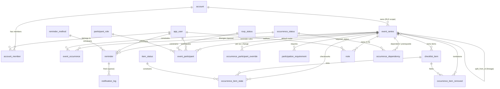

# Planner — Data Model (Supabase / Phase 2)

This is the canonical design for the synced backend. It supersedes the Phase‑1
in‑browser shape in [`src/types.ts`](../src/types.ts). The SQL that implements it
lives in [`supabase/migrations/`](../supabase/migrations); this document explains
**why** it is shaped this way so a future session can build on it with confidence.

Status: **design frozen.** The open questions from the design discussion have all
been decided (see [Decisions](#decisions)). The migrations are ready to apply.

---

## The one idea everything follows from

> **Every attribute lives at the grain at which it varies.**

A planner is mostly *recurring* events, and the hard part is that some facts
belong to the *definition* of a repeating thing and others belong to a *single
occurrence* of it. Conflate them and recurrence breaks. So the model has three
grains, and each table belongs to exactly one:

| Grain | Keyed by | Holds | Example tables |
|---|---|---|---|
| **Series** (definition / template) | `series_id` | title, schedule, checklist *lines*, default roster, reminder rules, notes | `event_series`, `checklist_item`, `event_participant`, `reminder`, `note` |
| **Occurrence** (one date of a series) | `(series_id, occurrence_start)` | reschedule/cancel/done, ticks, per‑occurrence roster changes, sent notifications, dependency edges | `event_occurrence`, `occurrence_item_state`, `occurrence_item_removed`, `occurrence_participant_override`, `notification_log`, `occurrence_dependency` |
| **Lookup** (closed vocab) | `code` | enumerable constants | `item_status`, `occurrence_status`, `rsvp_status`, `participant_role`, `reminder_method` |

`occurrence_start` is the **original** scheduled instant of an occurrence — its
permanent identity, even if the occurrence is later moved (`rescheduled_to`).
Occurrence rows are **sparse**: a row exists only when something diverges from
the series default (a tick, a cancel, a reschedule). A clean infinite series has
zero occurrence rows. This is the CalDAV / RFC‑5545 exception model.

> ⚠️ `occurrence_start` in the occurrence‑grain tables is deliberately **not** a
> foreign key to `event_occurrence` — most occurrences are *virtual* (never
> materialised). Its integrity is maintained by the app's calendar library, not
> by Postgres. See [Decision 4](#4-occurrence-identity-is-the-original-slot).

---

## Entity map

The authoritative column list is the SQL in `supabase/migrations/0001_schema.sql`.

---

## Decisions

These resolve every open question raised during design. Each is stated with the
rejected alternative so the trade is recoverable later.

### 1. Tenancy & access = `account`
A user belongs to one or more **accounts** (`account_member`); an `event_series`
belongs to one account. **Account membership is the only thing RLS checks.**
`event_participant` is *domain roster + RSVP + per‑user reminders* — who is
involved and notified — **not** an access mechanism. (The old `event_series.shared`
flag is gone; it was a third, ambiguous visibility lever.)
*Rejected:* participant‑scoped or per‑row sharing. It made every RLS policy a
union of three rules. Account‑scoped is one rule, joined down from the series.

### 2. Recurrence = RFC‑5545 RRULE strings, **never `COUNT`**
`event_series.rrule` is an iCal RRULE. Storage permits only **`UNTIL`‑bounded or
infinite** rules — `COUNT` is forbidden. All RRULE math (expansion, trimming,
re‑anchoring) happens **in the app** via a calendar library
([`rrule`](https://github.com/jkbrzt/rrule)); Postgres never parses a rule.
*Why ban `COUNT`:* on a series split the new series inherits the rule. `UNTIL` is
absolute and copies correctly; `COUNT` would restart the count and over‑generate.
Banning it makes a verbatim copy correct and makes `UNTIL` the single way a
series ends. Convert any `COUNT` rule to `UNTIL` at the app boundary before it is
ever stored.

### 3. "Edit this and following" = **series split**, not temporal versioning
Implemented by `split_series()` (migration `0003`). It ends the old series before
a cutover and starts a fresh copy from it, carrying every future per‑date row
onto the copy, atomically. There are **no** `valid_from`/`valid_until` ranges on
any table.
*Rejected:* per‑row temporal validity. It taxed *every read* with a range
predicate on three tables; splitting moves the cost to one rare write.
**Contract (load‑bearing):** the caller passes the **cutover** as a *genuine
`occurrence_start`* of the series (computed by the calendar lib — never raw
"now"), plus the *truncated* old rule. The new series is anchored at that slot,
so the future rows it adopts (which keep their original `occurrence_start`) land
exactly on its generated grid. Pass an arbitrary instant and you silently
reschedule the event and re‑orphan the rows. See the header comment in
`0003_functions.sql`.

### 4. Occurrence identity is the **original slot**
`(series_id, occurrence_start)` where `occurrence_start` is the instant the rule
*originally* produced. Moving an occurrence sets `rescheduled_to`; the identity
never changes. Because occurrences are virtual, `occurrence_start` is **not** an
FK. The corollary: you never edit a live series' `dtstart`/`rrule` in place in a
way that shifts the grid — that goes through `split_series`, which re‑homes the
dependent rows.

### 5. Checklist items are **series‑owned (copy semantics)**
The "item primitive" collapses into `checklist_item`: text (`label`), order
(`sort_order`, `group_label`), and ownership (`owner_series_id`) in one row. There
is **no shared `item` table and no cross‑checklist sharing** — editing one
checklist never changes another. On a split, list items are copied with **fresh
ids** and future ticks/tombstones retargeted to them; the two series fork.
*Rejected:* a normalized `item` + `checklist_item(item_id, position)` junction.
For a planner you almost always want copy semantics (my "milk" ≠ your "milk"); the
junction's only real payoff — sharing — is the behaviour we *don't* want, and it
buys nothing else over an owned, ordered row.
- `occurrence_start IS NULL` → a **list item**: part of every occurrence.
- `occurrence_start` set → a **one‑off add** to that single occurrence.
- `occurrence_item_removed` is the matching **tombstone**: hide a list item on
  one occurrence. Add and remove are symmetric.

### 6. Notes are **series‑owned (1:N)**, symmetric with items
`note.owner_series_id`; **no `event_note` junction.** A note belongs to one
series and is copied on split like any other attachment.
*Rejected:* the M:N `note`/`event_note` design. It was the lone asymmetry in the
schema (items copy, notes share) and it encoded a silent propagation policy
*inside* `split_series` (a copy and original sharing note rows across the split
boundary). It also hid a real bug: the M:N junction was never carried on split,
so future note attachments were lost. Owned notes fix both. A shared
"knowledge‑base note across events" is a separate, deliberate feature if ever
wanted — not the default.

### 7. Completion, with or without a checklist
- **No checklist:** set `event_occurrence.status` (a code from `occurrence_status`)
  to mark the whole occurrence done/skipped/blocked. `null` = compute.
- **With a checklist:** an occurrence is **done** when every `required`
  `checklist_item` for it has a `done` row in `occurrence_item_state`. This is
  derived in the app, not stored — `event_occurrence.status` left `null` means
  "compute from items." Setting it explicitly overrides the computation.

### 8. Dependencies = **enumerated per‑occurrence edges**
`occurrence_dependency` links a `(dependent_series, dependent_occurrence)` to a
`(prerequisite_series, prerequisite_occurrence)` with a `required_status`
(default `done`). There is **no rule form** — the app materialises edges as
occurrences are scheduled, and `split_series` rescues existing edges on both
ends. Acceptable at household scale; revisit if edge volume grows.

### 9. `event_series` carries `all_day`, `duration`, `created_by`, timestamps
Reintroduced from the Phase‑1 `CalendarEvent` and reconciled with the split
function (which references them). `dtstart` is `timestamptz`; an all‑day event is
`all_day = true` with `duration` in whole days. `dtstart`/`rrule` are `null` only
on templates.

### 10. Templates live in `event_series` (`is_template = true`)
A template has `is_template = true`, `dtstart`/`rrule` `null`, and owns
checklist items / roster / reminders / notes like any series. "New from template"
is an **app‑side deep copy** into a concrete series with a real `dtstart`, setting
`template_id` (provenance, nullable = standalone). Templates **cannot be split**
(the function guards against it). `split_from_id` records this‑and‑following
lineage, distinct from `template_id`.

---

## What this maps to from Phase 1

| Phase‑1 (`src/types.ts`) | Phase‑2 |
|---|---|
| `CalendarEvent` | `event_series` (+ `event_occurrence` for divergences) |
| `CalendarEvent.recurrence` (`freq`+`interval`) | `event_series.rrule` (RFC‑5545; `DAILY/WEEKLY/MONTHLY` + `INTERVAL`) |
| `Attachment{kind:'checklist'}.items[]` + `ChecklistEntry` | `checklist_item` rows |
| `Attachment{kind:'note'}` | `note` rows |
| `Attachment{kind:'reminder'}.offset` (minutes) | `reminder.offset_seconds` |
| `AppState.completions[ev:date].checked[entry]` | `occurrence_item_state` |
| `AppState.completions[ev:date].status` (`done`/`skipped`/`blocked`) | `event_occurrence.status` |
| `AppState.dependencies[ev:date][]` (occurrence‑keyed) | `occurrence_dependency` (occurrence→occurrence) — **realized**; the app is occurrence‑keyed, not the old event‑level `dependsOn[]` |
| `Person` / `PersonId` (`me`/`partner`/`kid`) | `app_user` + `event_participant` |
| `ListItem` (standalone to‑dos) | **not yet mapped** — see open items |

### Deferred (not blocking)
- **Standalone Lists** (`ListItem`): the undated to‑do view has no backend table
  yet. It's a single‑context list, so its `done` lives on the item (unlike
  checklist entries). Likeliest shape: a `list` + `list_item` pair scoped to
  `account_id`. Decide when building that view.
- **Participant‑level RLS granularity** (owner vs member write rights): the
  baseline policies treat any account member as able to read/write the account's
  series. Tighten with an `account_member.role` check when it matters.

---

## Migrations

Apply in order. See [`NEXT_SESSION.md`](./NEXT_SESSION.md) for the full connect‑and‑apply runbook.

| File | Contents |
|---|---|
| `0001_schema.sql` | Tables, lookup seeds, indexes, constraints |
| `0002_rls.sql` | `is_account_member` / `can_access_series` helpers + RLS policies |
| `0003_functions.sql` | `split_series`, `create_account`, new‑user mirror trigger |
| `0004_grants.sql` | Base‑table `GRANT`s to `authenticated` (RLS alone isn't enough) |
| `0005_person.sql` | People as DATA: `person` + `event_person` (overrides Decision 1's roster) |
| `0006_realtime.sql` | Calendar tables → `supabase_realtime` publication |
| `0007_user_preferences.sql` | Per‑user `user_preference` JSON blob (personal colour overrides) |
| `0008_realtime_dependencies.sql` | `occurrence_dependency` → `supabase_realtime` publication |
